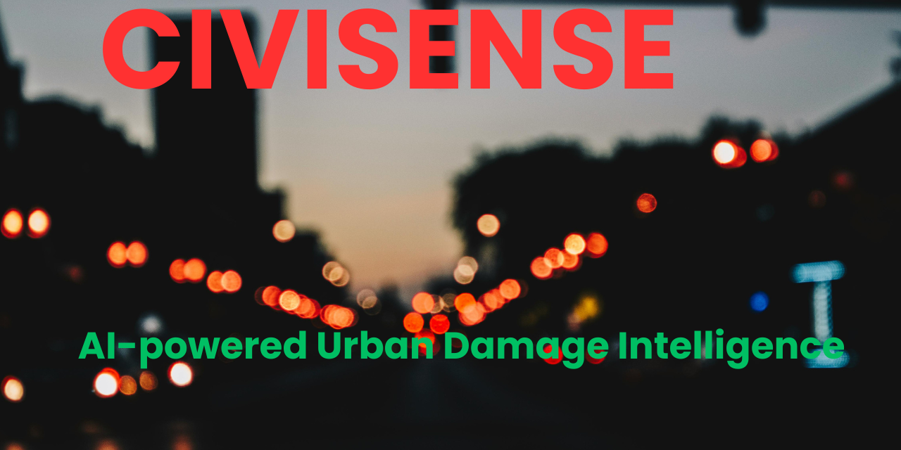

<p align="center">
  
</p>

**## CIVISENSE**

 
 


**CIVISENSE** is an end-to-end computer vision system that detects road infrastructure damage, evaluates its severity, and continuously monitors model health using drift detection techniques.
The project simulates a real-world smart city AI pipeline by combining computer vision, backend APIs, model monitoring, and database logging.

**Features**

 Road Damage Detection (YOLOv11)

Detects potholes, cracks, and surface damage from road images

 Severity & Risk Scoring Engine

Assigns severity scores and classifies risk levels (LOW / MEDIUM / HIGH)

 FastAPI Backend

Real-time inference and model-health endpoints

 Model Drift Monitoring

Detects confidence, bounding-box area, and detection-frequency drift

 MongoDB Atlas Integration

Stores predictions and model-health logs for analytics and auditing

 System Architecture
```
Image Input
    ↓
YOLOv11 Damage Detector
    ↓
Severity & Risk Engine
    ↓
MongoDB Atlas
    ↓
Drift Monitoring Module
    ↓
FastAPI Endpoints
```

 **Tech Stack**
Layer	Tools
Computer Vision	YOLOv11 (Ultralytics), PyTorch
Backend API	FastAPI
Database	MongoDB Atlas
Model Monitoring	Statistical Drift Detection

 **Dataset & Model**

Trained using RDD2022 and Roboflow Road Damage datasets

Dataset includes potholes, cracks, and surface damage

Model weights (damage_detector.pt) are excluded from this repository due to size and licensing constraints

 How to Run Locally
```
# Install dependencies
pip install -r requirements.txt

# Start FastAPI server
uvicorn backend.app:app --reload
```

Once running:
```
# Go to API Docs
API Docs: http://127.0.0.1:8000/docs
```

 **API Endpoints**
Method	Endpoint	Description
POST	/predict	Detect road damage from uploaded images
GET	/model-health	Retrieve drift metrics and model status

**_Sample_**


